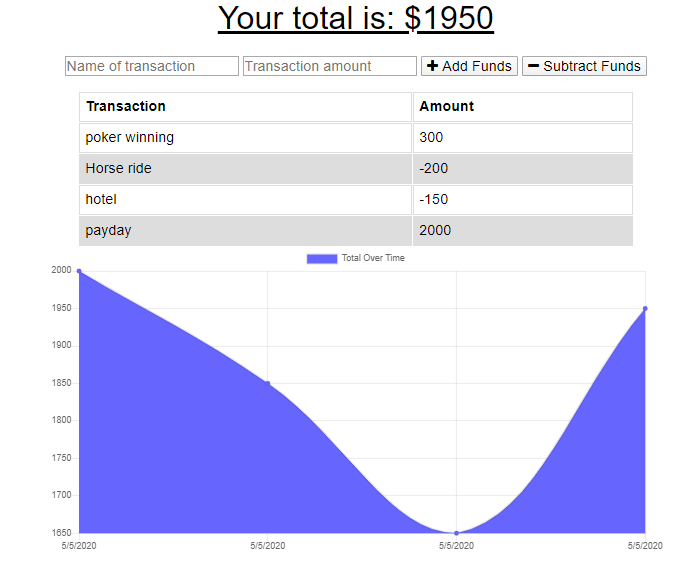

# Budget Tracker
Deployed App: https://stark-lake-53298.herokuapp.com/
[]
## Description
With this app, the user can track all of their transactions. Also, using Progressive Web Apps, I have also made it available for use on line.

## Installation
It is for use in the browser, it can also be installed from the browser.

## Usage
Look for budget tracker on my repositories, or follow the link to the deployed application.
## License
This project is not currently licensed

## Contributing
No need to contribute as of now
## Questions
If you have any questions, you could email me at ayalanick84@gmail.com, or message me on github https://api.github.com/users/ayalanick84

